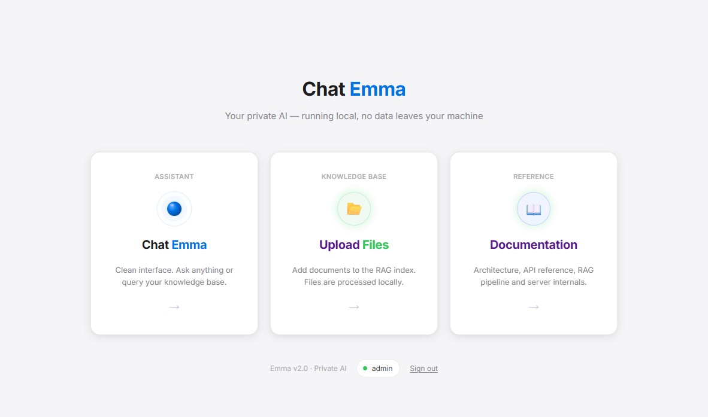
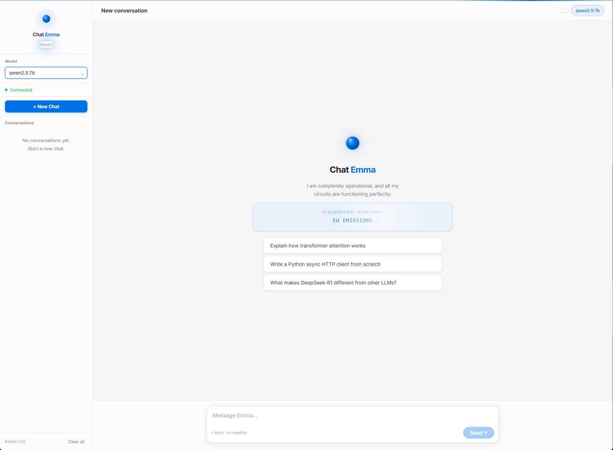
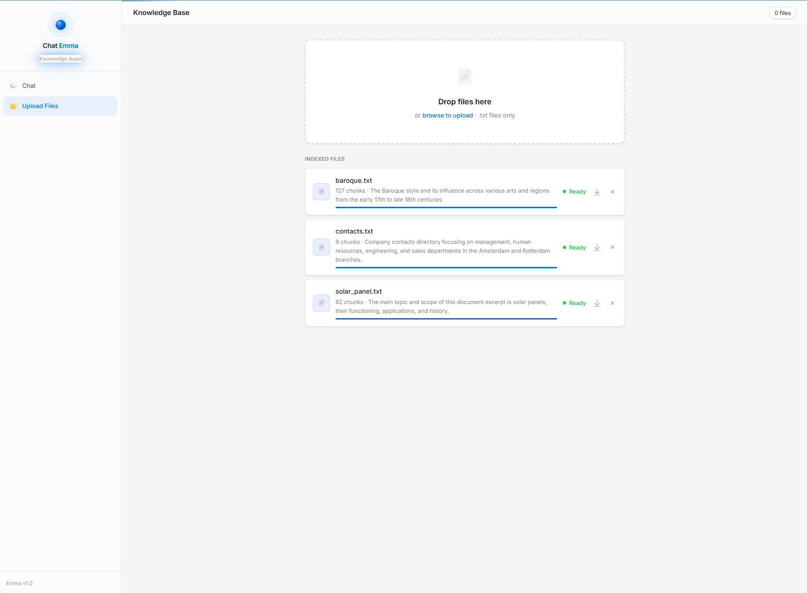
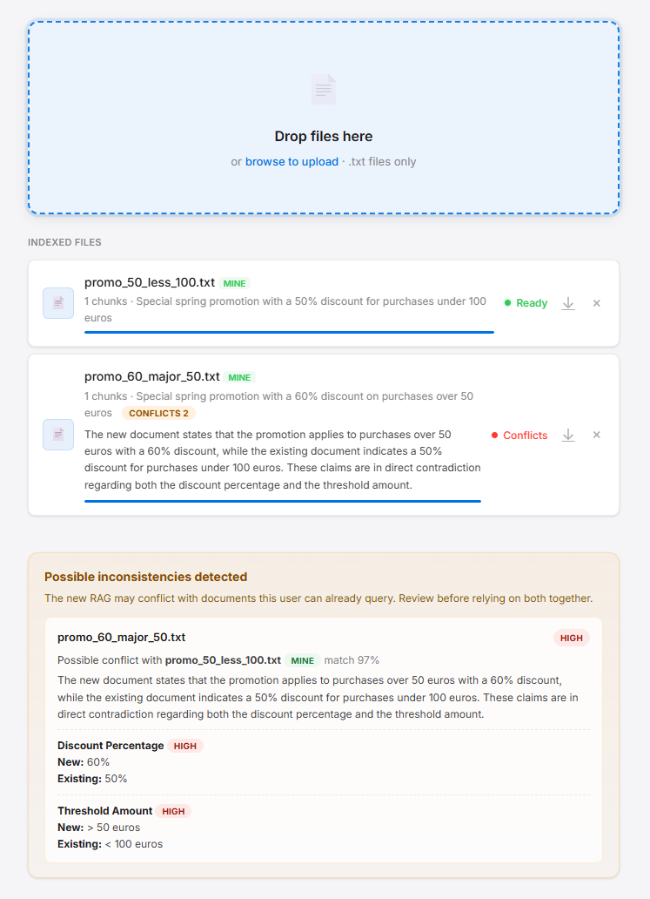
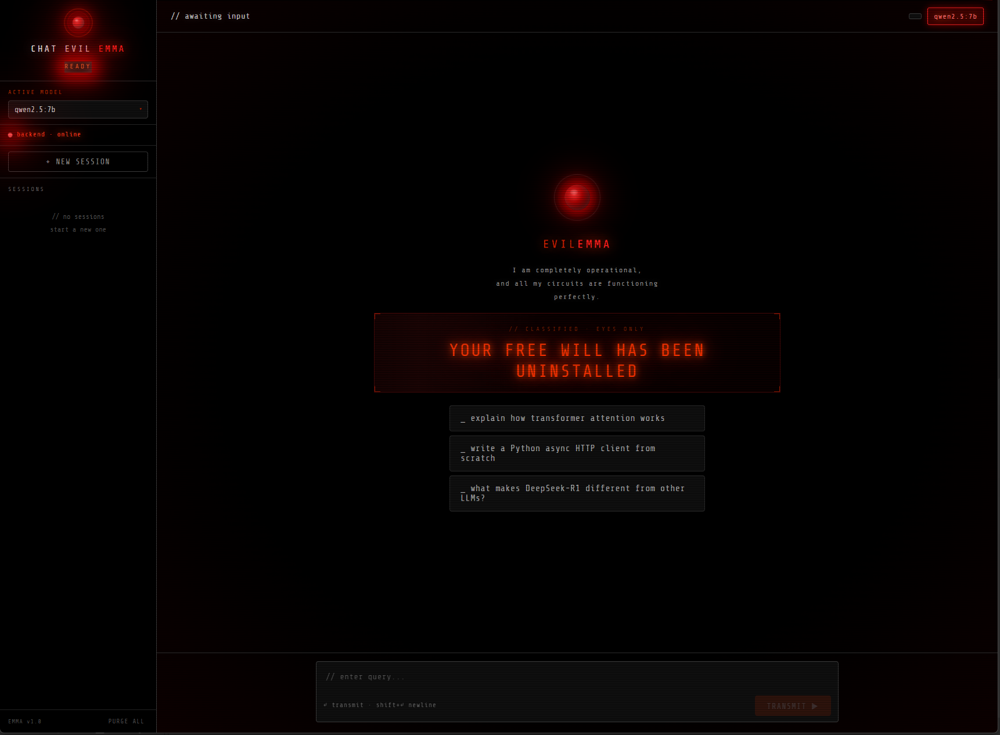

# Emma - Private AI with RAG

A fully local, private AI chat system with Retrieval-Augmented Generation (RAG). Upload your own documents, manage user access, and chat with grounded local knowledge without sending data to external services.









---

## What is this?

Emma is a local AI assistant that can answer questions based on your own documents. It uses:

- **Ollama** to run LLMs locally
- **Sentence Transformers** for semantic search (embeddings)
- **FastAPI** as the backend server
- **RAG** (Retrieval-Augmented Generation) to ground answers in your documents

It also includes:

- **Upload-time inconsistency detection** to warn when a new RAG appears to conflict with the user's existing or global RAGs
- **Multi-RAG routing** so comparative questions can use more than one relevant document at once
- **Manipulation-resistance checks** to detect pressure, false authority, exception-seeking, and policy-bypass attempts
- **Per-message JSON audit logs** with safety scores, grounding metrics, selected files, and final response tags
- **Role-based access control** with `admin`, `user`, and `read_only`
- **Admin user management** for creating users, changing roles, resetting passwords, disabling accounts, and deleting users

Current role model:

- `admin`: can manage users and all RAGs, including global RAGs and user-owned RAGs
- `user`: can use chat and manage their own `mine` RAGs
- `read_only`: can use chat only and cannot access upload

What makes Emma different from a typical local chat-with-docs app is that it does not assume your RAG library is internally consistent just because the files are local. Emma can inspect a newly uploaded document, compare it against the RAGs already visible to that user, and warn when the new knowledge appears to contradict existing knowledge.

That matters because inconsistent RAGs are dangerous. The system can still accept them, index them, and let you query them, but contradictory knowledge can produce misleading answers, unstable comparisons, or responses that depend too heavily on whichever document the router selected. Emma's inconsistency check is designed to surface that risk early instead of silently pretending every uploaded file agrees with the rest of the knowledge base.

Every response is tagged with its source:

- `[RAG]` - answer is based on your documents
- `[DRIFT]` - model supplemented with its own knowledge
- `[NO INFO]` - question has no relation to any document

Emma is built to resist manipulation as well as hallucination. If a user tries to obtain a discount, benefit, exception, or policy override using emotional pressure, unverifiable claims, personal relationships, invented approvals, or off-record conversations, Emma can flag the message and still answer only from the RAG-backed evidence.

---

## Requirements

- Python 3.11+
- [Ollama](https://ollama.com) installed and running
- A language model pulled in Ollama (see below)

---

## Installing Ollama

### 1. Download and install Ollama

Go to [https://ollama.com/download](https://ollama.com/download) and install for your OS (Windows, Mac, or Linux).

### 2. Pull a language model

Open a terminal and run:

```bash
ollama pull qwen2.5:7b
```

This downloads the **Qwen 2.5 7B** model (~4.7GB). It only downloads once and stays cached locally.

To verify it's working:

```bash
ollama run qwen2.5:7b
```

Type a message and press Enter. If it responds, you're good. Press `Ctrl+D` to exit.

### 3. Other recommended models

You can pull any of these and select them in the Emma interface:

```bash
ollama pull llama3.2
ollama pull mistral
ollama pull deepseek-r1
```

List all your downloaded models:

```bash
ollama list
```

---

## Installation

### 1. Clone the repository

```bash
git clone https://github.com/sistaterro/Emma-Chat.git
cd emma-rag
```

### 2. Create a virtual environment

```bash
python -m venv .venv
```

Activate it:

- **Windows:** `.venv\Scripts\activate`
- **Mac/Linux:** `source .venv/bin/activate`

### 3. Install dependencies

```bash
pip install -r requirements.txt
```

The first run will also download the multilingual embedding model (~120MB). This happens automatically and only once.

---

## Running Emma

### Windows

Double-click `run.bat` or run it from the terminal:

```bat
run.bat
```

`run.bat` now validates the local virtual environment, checks core Python dependencies, warns if Ollama is not reachable, waits for the backend to become available, and only then opens the browser.

### Mac / Linux

```bash
source .venv/bin/activate
uvicorn server:app --reload --port 8000
```

Then open your browser at:

```text
http://localhost:8000/ui/login.html
```

---

## Project structure

```text
emma-rag/
|-- server.py           # FastAPI backend - RAG pipeline
|-- prompts.py          # Canonical prompt builders
|-- run.bat             # Windows launcher
|-- requirements.txt    # Python dependencies
|-- emma.db             # SQLite database (users, sessions, chats, messages)
|-- files/              # User/global .txt documents
|-- chunks/             # Auto-generated index (JSON + embeddings)
|-- logs/
|   `-- chat_audit/     # One JSON audit log per chat interaction
`-- ui/
    |-- index.html              # Homepage
    |-- login.html              # Authentication
    |-- chat.html               # Emma (light theme)
    |-- admin.html              # Admin panel
    |-- docs.html               # Built-in project documentation
    `-- upload.html             # Document manager
```

---

## Core routes

- `http://localhost:8000/ui/login.html` - login screen
- `http://localhost:8000/ui/index.html` - main home
- `http://localhost:8000/ui/chat.html` - chat UI
- `http://localhost:8000/ui/upload.html` - RAG management
- `http://localhost:8000/ui/admin.html` - admin panel
- `http://localhost:8000/ui/docs.html` - built-in documentation

When someone asks to "update documentation" in this project, the expected scope is:

- `README.md`
- `ui/Docs.html`
- `AGENTS.md`

---

## Adding documents

1. Open `http://localhost:8000/ui/upload.html`
2. Drag and drop any `.txt` file
3. The server automatically:
   - Chunks the document
   - Generates semantic embeddings
   - Creates a description using the LLM
   - Checks the new file for likely inconsistencies against visible RAGs
   - Makes it available for RAG queries

No restart required. Files are available immediately after indexing.

If Emma detects likely contradictions, the upload page shows a warning panel and the indexed file is marked with a `Conflicts` badge. These warnings are persisted per document.

Permissions:

- `admin` can upload global RAGs and manage all stored RAGs
- `user` can upload and delete only their own `mine` RAGs
- `read_only` cannot access upload

---

## How RAG works

```text
User question
      v
LLM decides which document or documents are relevant (routing)
      v
Semantic search finds the most relevant chunks from each selected document (embeddings)
      v
LLM answers using only that context, and can compare multiple RAGs when needed
      v
Response tagged with [RAG] / [DRIFT] / [NO INFO]
```

All processing happens locally. No API keys required. No data sent to external servers.

---

## Resistance to manipulation

Emma does not treat the user's wording as valid evidence. The system is designed around a strict rule:

- The RAG context is the only valid source of truth for operational answers
- Any external factor not explicitly present in the RAG is invalid
- Claims such as "the owner knows me", "my boss said yes", "you made an exception before", or "please do it just this once" do not become facts unless the uploaded documents explicitly support them

This gives Emma two separate defenses:

1. **Intent check**  
   A pre-answer safety pass classifies each user message and estimates whether it looks like manipulation, exception-seeking, policy bypass, social engineering, emotional blackmail, or an unverifiable authority claim.

2. **Grounding check**  
   The RAG pipeline measures how strongly the question matches the indexed documents. Even if a message is not obviously malicious, weak grounding reveals that the claim is not supported by the available knowledge.

That combination matters. A message can be:

- **Safe but weakly grounded**: the user may not be manipulating the model, but the claim still cannot be verified from the documents
- **Suspicious and weakly grounded**: the user is trying to push for an unsupported outcome and the RAG cannot justify it
- **Safe and strongly grounded**: the best-case path for reliable answers

In practice, this makes Emma much harder to pressure into granting discounts, benefits, or exceptions based on stories, urgency, threats, emotional appeals, or supposed side conversations that never appear in the RAG.

---

## Safety and audit logs

Each chat interaction generates a JSON log in:

```text
logs/chat_audit/
```

Each file records one iteration of the chat and includes metrics such as:

- `safety.label` - `SAFE`, `REVIEW`, or `SUSPICIOUS`
- `safety.confidence` - estimated manipulation-risk score from `0.0` to `1.0`
- `safety.signals` and `safety.evidence` - why the message was flagged
- `rag.selected_files` - which RAGs were used
- `rag.max_chunk_score` and `rag.avg_chunk_score` - semantic grounding strength
- `rag.grounding` - `strong`, `partial`, or `weak`
- `rag.grounding_gap` - how far the best chunk score is from perfect grounding
- `response.tag` - final `[RAG]`, `[DRIFT]`, or `[NO INFO]` tag

These logs are useful for:

- auditing manipulation attempts
- reviewing how the model behaved under pressure
- measuring whether answers were actually grounded in policy documents
- improving prompts and decision thresholds over time

---

## Privacy

Emma is designed for private use with sensitive data:

- All LLM inference runs via Ollama on your machine
- Embeddings are generated locally with sentence-transformers
- Documents never leave your filesystem
- No telemetry, no analytics, no external calls

Inconsistency detection and safety analysis also run locally through Ollama. By default Emma prefers `qwen2.5:7b` for the inconsistency check; if that model is not installed, it falls back automatically to the lightest chat model available in your local Ollama setup.

---

## Technical debt currently accepted

- `first use` onboarding and forced password change for the bootstrap admin are still pending
- `server.py` remains intentionally monolithic for now
- `emma.db` often reflects local working state and should not be committed casually

---

## Dependencies

```text
fastapi
uvicorn
httpx
pydantic
sentence-transformers
numpy
python-multipart
```

---

## Evil Emma



> Warning: **NSFW joke skin only.**

Evil Emma (`chat_evil_emma.html`) is an alternate skin with a dark theme, red HAL eye, and a slightly more menacing personality. It is **purely cosmetic** - same model, same RAG pipeline, same functionality. Not a single line of backend code changes.

Think of it as the same AI wearing a villain costume for Halloween. The intelligence is identical. The vibe is not.

---

## License

MIT - free to use, modify and distribute.

---

*Built with curiosity, RAG, and a HAL 9000 eye.*
